# Authentication and JWTokens

Documentation: https://www.rfc-editor.org/rfc/rfc6749

### What are tokens and what do we need for them?
    - way for securely transmitting information between parties as a JSON object
    - JWTs can be signed using a secret (with the HMAC algorithm) or a public/private key pair using RSA or ECDSA.

### What is an OAuth token?
    - OAuth 2.0 uses Access Tokens. An Access Token is a piece of data that represents the authorization to access resources on behalf of the end-user. OAuth 2.0 doesn't define a specific format for Access Tokens. However, in some contexts, the JSON Web Token (JWT) format is often used.

### What info is in that token?
    - In its compact form, JSON Web Tokens consist of three parts separated by dots, which are: Header, payload, signature
    - usually it looks like the following: xxxxx.yyyyy.zzzzz
    - Header:
        - *typically* consists of two parts: the type of the token, which is JWT, and the signing algorithm being used, such as HMAC SHA256 or RSA.
        - example:
        {
        "alg": "HS256",
        "typ": "JWT"
        }
    - Payload:
        - The second part of the token is the payload, which contains the claims. Claims are statements about an entity (typically, the user) and additional data. There are three types of claims: *registered*, *public*, and *private* claims.
        - Example:
        {
        "sub": "1234567890",
        "name": "John Doe",
        "admin": true
        }
    - Signature:
        - To create the signature part you have to take the encoded header, the encoded payload, a secret, the algorithm specified in the header, and sign that.
        - Example:   
            HMACSHA256(
            base64UrlEncode(header) + "." +
            base64UrlEncode(payload),
            secret)

### What is access token?
    - Part of the oAuth2 flow
    - That we give to a client once they ask to call a ressource on behalf of the user
    - To get it the user as to authenticate themselves
    - Client doesn’t have to know whats inside the access token
        - Only that its valid and can be send to the resource to call the API succesfully
    - Resource is able to look inside of that access token
        - FIgure out who the user is and execute whatever action they were asked to do on the users behalf
    - They only last for around one hour!! But can also be revoked earlier (example: logout)
    - Acess tokens are only good for a single ressource

### What is refresh token?
    - Also part of the oAuth2 flow
    - Given to the client
    - Client uses them to refresh or get new copies of the ID token and access tokens once those expired
    - They can last effectively forever!!
    - You can use them to get multiple access tokens using a single authentication
    - Function similar to a session token
    - Saved in the user account of the application for the next time the application needs access an API on bhealf of the user
    - Example: User logged into app → closes it and reopenes next day → refresh token makes it possible to still access your data without login in again

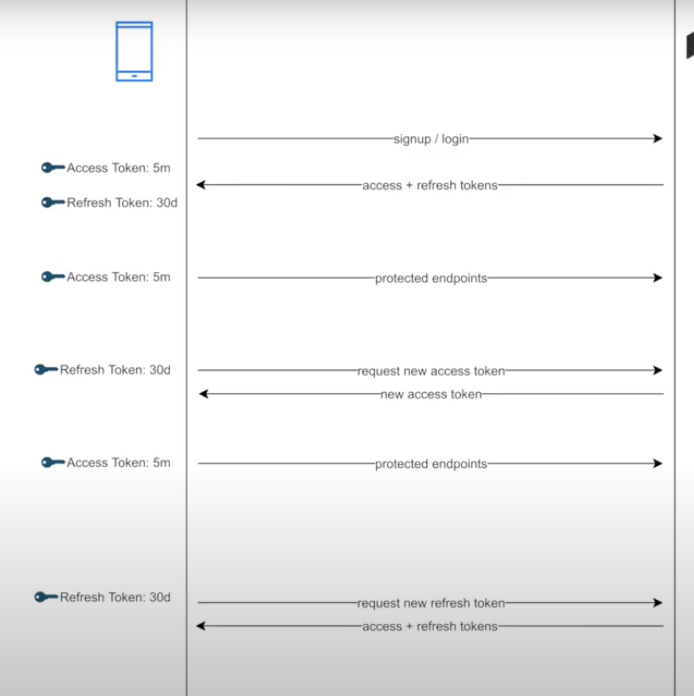

### How to create them in express.js

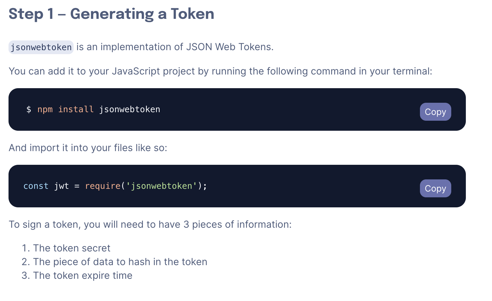
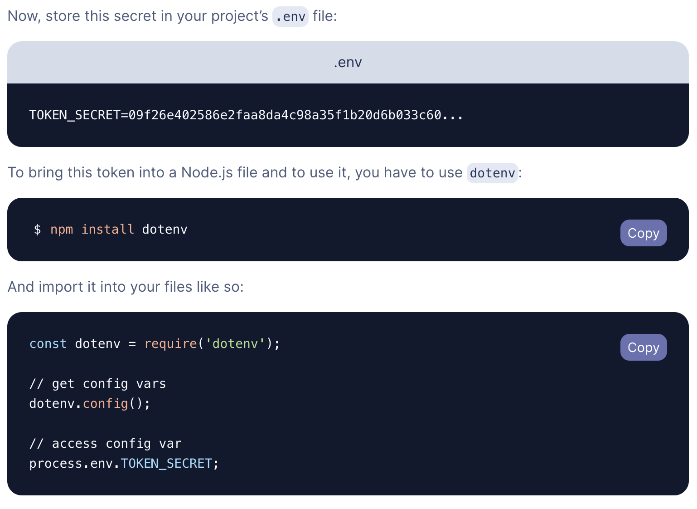
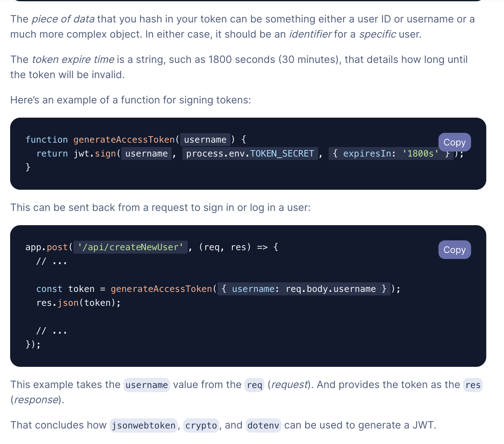
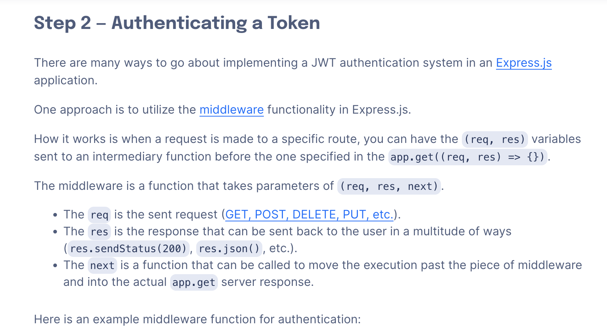
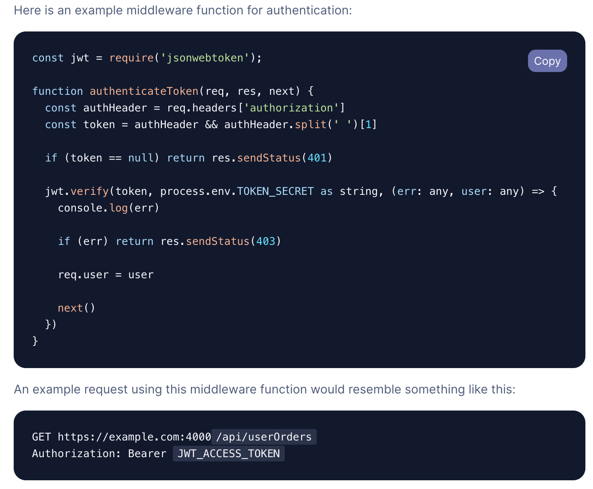
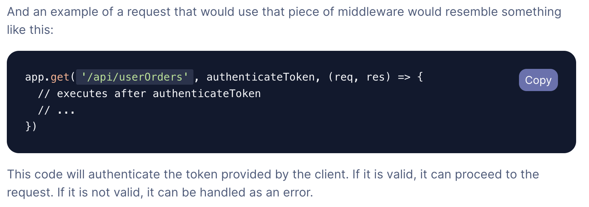
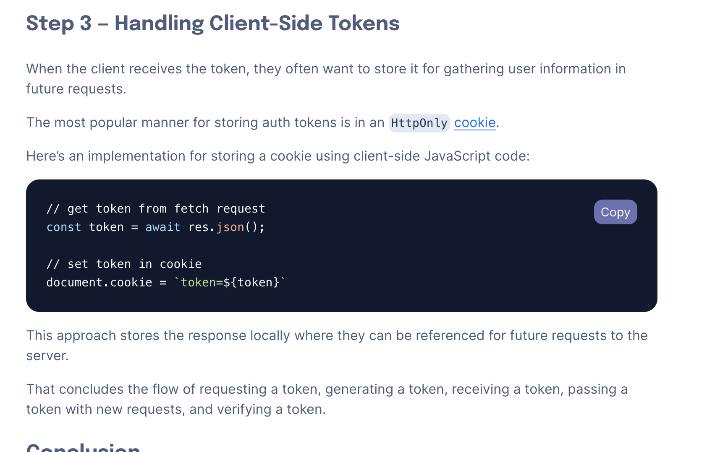

### Access token response

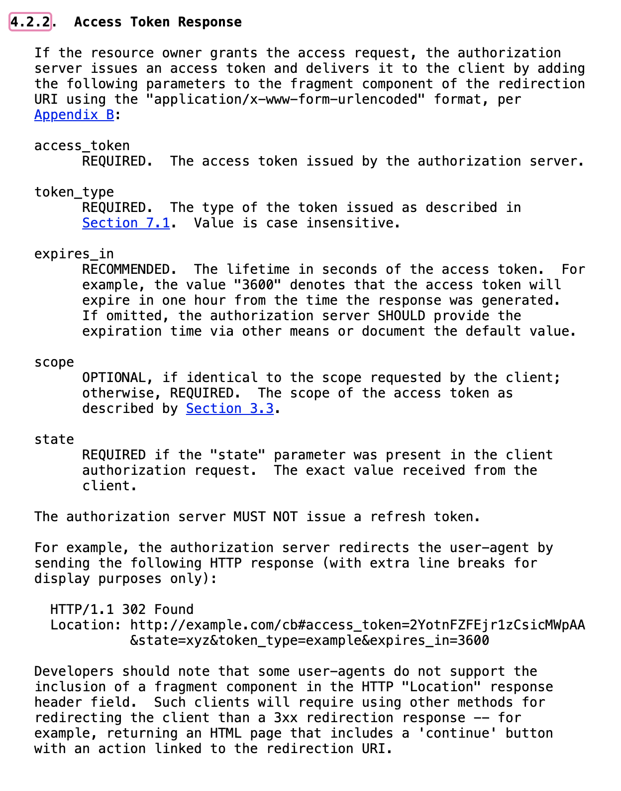

### How to check if token is still valid?

    - Upon receiving a valid access_token, expires_in value, refresh_token, etc., clients can process this by storing an expiration time and checking it on each request
    - Other method of handling token refresh is to manually refresh after receiving an invalid token authorization error. This can be done with the previous approach or by itself.
    - If your refresh token has also expired, you will need to go through the authorization process again.
        - The OAuth 2.0 spec doesn't define refresh token expiration or how to handle it, however, a number of APIs will return a refresh_token_expires_in property when the refresh token does expire

    Following steps for expiration time check:
    - convert expires_in to an expire time
    - store the expire time
    - on each resource request, check the current time against the expire time and make a token refresh request before the resource request if the access_token has expired

### What kind of secret key do we need to provide?
    - First of all you shouldn't use a third party to generate your secret key
    - Use the standard HSA 256 encryption for the signature, the secret should at least be 32 characters long, but the longer the better
    - Create it yourself

    Example:

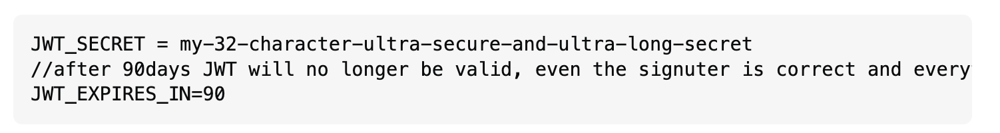
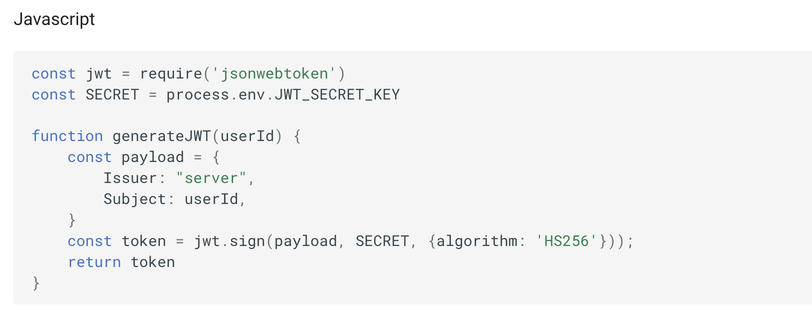